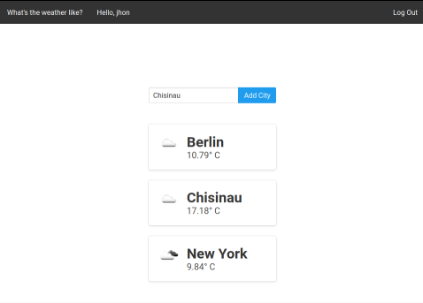
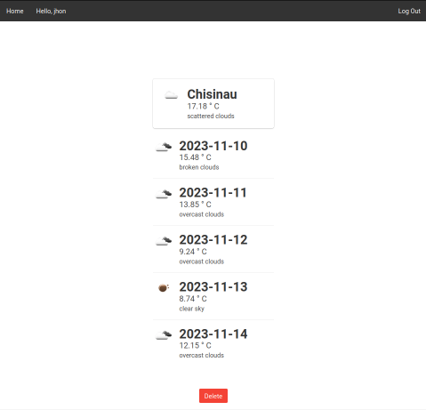

<h1 align="center">
  <br>
  Weather_app
  <br>
</h1>
<p align="center">


</p>

## Key Features:

* User Authentication
* Current Weather
* Search Functionality
* Weather Forecast
* API Endpoints

## How To Use:

```bash
# Clone this repository

# Run Docker
$ docker-compose up --build

```

##  API:
*** - /api/weather/current/ *** shows the the current weather of the locations that the logged user has saved
<br>
***  - /api/weather/search/<city> *** searches a city and presents curent weather
<br>
*** - /api/weather/forecast/<city>  *** presents the weather forecast of the chosen city
<br>

